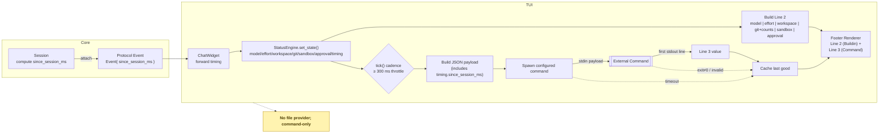

# Status Display & Timing — Unified Requirements

## Problem Statement
We need a simple, provider‑agnostic way to (a) obtain a wall‑time value directly from Codex stdin (proto JSONL) to compute total_duration_ms in real time, and (b) present a compact, configurable status area in the TUI footer powered by a single engine. Proto events today lack timing fields; relying on external logs violates the stdin‑only goal. Footer content should be produced by a StatusEngine with a stable public API and rendered by a thin view.

## Goals
- Timing: derive total_duration_ms from stdin via a monotonic field on proto events.
- Status: add a StatusEngine that composes Line 2 from predefined items and accepts a generic provider for Line 3 (e.g., network probing).
- Keep the design cross‑platform, backward‑compatible, low‑overhead, and extensible (command provider).

## Non-Goals
- Do not implement API‑only timing (total_api_duration_ms) in the first iteration.
- Do not redesign protocol types; timing is additive to the CLI proto output only.
- Do not bake provider/model‑specific assumptions into the engine.

## User Scenario
As a user running `codex proto` with a statusline:
- I compute total_duration_ms from stdin to drive COLD/GREEN/RED windows.
- I see a concise Line 2 with model/effort/workspace/git/sandbox/approval.
- I can surface extra signals (e.g., network probing) on Line 3 via a file or a Claude‑style command.

## Functional Requirements
1) Timing (stdin‑only)
- Each proto event includes `since_session_ms: number` (monotonic ms since the latest `session_configured`).
- `since_session_ms` resets on every `session_configured` (e.g., when the user runs `/new`).
- Clients compute `total_duration_ms = max(since_session_ms)` and may extrapolate between events with a local monotonic clock.

2) StatusEngine (footer)
- Line 1 (existing): key hints + tokens used + context left (unchanged).
- Line 2 (predefined, selectable items):
  - Catalog (initial): `model`, `effort`, `workspace_name`, `git_branch`, `git_counts` ("+x -x"), `sandbox`, `approval`.
  - Default order: `model | effort | workspace_name | git_branch+git_counts | sandbox | approval`.
  - `git_branch`: current branch (fallback `detached` or omit) with center‑ellipsis when width‑constrained.
  - `git_counts`: best‑effort `+x -x` since a baseline (e.g., `HEAD`), throttled and optional.
- Line 3 (generic, optional feed): produced by a Command provider (external):
  - run a configured command with a JSON payload on stdin; first stdout line becomes Line 3.
- Rendering consumes strings from the engine and paints them; it does not own business logic.

3) Public API (statusengine.rs)
- `new(config: StatusEngineConfig) -> StatusEngine` — includes `command_timeout_ms` (150–500 ms, configurable). The engine enforces a built‑in 300 ms throttle between external provider invocations.
- `set_state(StatusEngineState)` — update inputs (model, effort, cwd/workspace, sandbox, approval, git {branch, counts}, optional timing fields).
- `set_line2_selection(items: &[StatusItem])` — select/order predefined items for Line 2.
- `tick(now) -> StatusEngineOutput { line2: String, line3: Option<String> }` — respect the 300 ms throttle and provider precedence (command > file > builtin).

## Config (TOML) for StatusEngine

- Location: ~/.codex/config.toml
- Section: [tui]
- Keys:
    - statusengine = true               # enable the feature (if absent or false → StatusEngine disabled; Line 1 only)
    - provider = "command" | "builtin"  # provider for Line 3; if unset or "builtin" → render Line 2 only
    - command = "path/to/executable"    # used only when provider = "command"
    - command_timeout_ms = 350          # allow more time if the script aggregates many items (typical 150–500 ms)

## Non-Functional Requirements
- Cross‑platform monotonic timing.
- Backward‑compatible outputs; renderer only consumes strings.
- Throttle: the engine MUST NOT invoke external providers more frequently than once every 300 ms (hardcoded). `command_timeout_ms` is configurable (150–500 ms typical). Throttle expensive work (e.g., Git) and cache results.
- Styling matches TUI conventions (dim defaults; minimal accents); width‑aware truncation (center‑ellipsis for branch).
- Security/Privacy: stdin‑only timing; providers run with strict timeouts and minimal env.

## Acceptance Criteria
- Timing: `since_session_ms` present and non‑decreasing on all proto events; `total_duration_ms = max(since_session_ms)` within < 200 ms of a stopwatch for sessions > 5 s.
- StatusEngine:
  - Line 2 reflects current model/effort/workspace/git/sandbox/approval; updates within one render frame after state changes.
  - Git segment shows branch; `+x -x` appears when available; omission does not break layout; branch ellipsizes under pressure.
  - Line 3 appears when a provider yields data (within ~1 cadence) and disappears gracefully when absent.
- Rendering: Line 1 content unchanged; additional lines do not cause flicker on small terminals (within existing wrapping rules). Providers must not block UI or proto stdout.

## Constraints & Assumptions
- Sessions are bounded within a `codex proto` run; `/new` emits `session_configured` and resets `since_session_ms`.
- Git segment is best‑effort and may be omitted on large repos/timeouts.
- File provider assumes workspace write access; engine still operates without it (Line 2 only).
- Narrow terminals may not fit three lines; truncation is acceptable.
 - Windows path expansion: `~` and `$HOME` expansion are platform‑specific; implementations SHOULD expand only where applicable (e.g., Unix‑like systems) and otherwise treat paths as given.
 - ANSI support: Line 3 rendering SHOULD support ANSI color; terminals lacking ANSI fall back to plain text.

## Risks & Open Questions
- Emit timing fields always vs behind a CLI flag (e.g., `--proto-emit-timestamps`)?
- Finalize command provider schema/timeouts to match Claude’s documented behavior.
- Confirm provider precedence and error policy (use last good line on failures/timeouts).
- Clarify when to trigger the command: the engine SHOULD trigger on proto event arrivals but MUST respect the 300 ms throttle; it MAY also periodically refresh when no events arrive if the script depends on time‑based updates.
- Future: core spans for `total_api_duration_ms`.
 - Detached HEAD: `git_branch` may be `detached` or omitted; Line 2 must remain stable.
 - Minimal terminal height: if height < 2, render Line 1 only; Line 2/3 are omitted.
 - Event storms: file provider reads MUST also be throttled by the same 300 ms cap to avoid I/O churn.

## Success Metrics
- Coverage: ≥ 99% of proto events include `since_session_ms`.
- Accuracy: |reported − stopwatch| < 200 ms for sessions > 5 s.
- Engine cadence: 95th percentile provider latency < `command_timeout_ms`; no UI stalls.
- Adoption: statusline and (optionally) `/status` renderer use StatusEngine outputs and stdin‑only timing.
 - Snapshot/golden coverage: stable outputs across narrow/medium/wide widths and with/without Git/Line 3.

## Standards Alignment
- OpenAI Responses `created_at` (server wall‑clock) is suitable for correlation but not window timing; prefer `since_session_ms` for COLD/GREEN/RED.
- Claude‑style statusline: command provider uses stdin JSON → first‑line stdout; cadence ≤ 300 ms; short timeouts; unknown fields tolerated.

## Potential Benefits for Auditing/Security (Non‑Goals; Nice‑to‑Have)
- Client‑observed end‑to‑end timing complements server spans for UX/SLO.
- Stall detection from the client vantage; easier incident triage with session_id + created_at.
- Treat client fields as advisory; not for billing/enforcement. Not API time.

## Integration Model (Entry Points)

### CLI (proto) integration — required
 - The proto JSONL event schema and stdout remain unchanged.
 - After emitting each Event to stdout in `cli/src/proto.rs`, the process also (off the stdout hot path):
  - Updates StatusEngine state from the Event (e.g., session_id/model on `session_configured`; cwd/approval/sandbox/model/effort from `Op::UserTurn`/`Op::OverrideTurnContext`).
  - Schedules an engine tick. The engine coalesces bursts and will invoke the external provider at most once every 300 ms. Provider work runs off the stdout hot path (non‑blocking), reusing the last good line on failures/timeouts.

### TUI integration — required to render in the footer
- To display Line 2/Line 3 inside the TUI footer and keep them updated:
  - On each relevant AppEvent (e.g., `SessionConfigured`, `UpdateModel`, `UpdateReasoningEffort`, `UpdateAskForApprovalPolicy`, `UpdateSandboxPolicy`), call `StatusEngine::set_state(...)`.
  - In the render cadence, call `StatusEngine::tick(now)`; the engine enforces the 300 ms cap and returns `{ line2, line3? }` for the renderer to paint below Line 1.
- Without this TUI integration, the TUI will not show Line 2/3 (CLI proto and external consumers may still use the engine separately).
 - Width negotiation: the renderer SHOULD pass the available width to the engine (or invoke width‑aware composition helpers) so Line 2 can apply center‑ellipsis to long segments (e.g., branches).

## Command Provider Appendix

### Stdin JSON payload (example)
- The engine sends a compact JSON object to the configured command’s stdin. Unknown fields must be ignored for forward compatibility.
```jsonc
{
  "session_id": "<uuid>",
  "cwd": "/abs/path/to/workspace",
  "workspace": {
    "current_dir": "/abs/path/to/workspace",
    "project_dir": "/abs/path/to/workspace",
    "name": "codex"
  },
  "model": { "id": "gpt-5" },
  "effort": "medium",
  "sandbox": "workspace-write",
  "approval": "on-request",
  "timing": { "since_session_ms": 12345 },
  "git": { "branch": "feature/awesome", "+": 12, "-": 4 }
}
```
- Notes:
  - All Line 2 items are included: `model.id`, `effort`, `workspace.name` (basename of cwd), `git.branch` (plus/minus counts best‑effort), `sandbox`, `approval`.
  - timing.since_session_ms is the stdin‑only timing value; total_duration_ms can be derived by the consumer or omitted.
  - git `+`/`-` counts may be omitted when unavailable or time‑boxed; `branch` is commonly available via the existing git helpers.
  - Fields not present in the current codebase (e.g., display_name, version, output_style) SHOULD be omitted.

### Stdout rules
- Only the first line of stdout is rendered as Line 3; additional lines are ignored.
- ANSI color is allowed; the renderer truncates to fit the available width.
- The engine enforces `command_timeout_ms` (e.g., 150–500 ms). On timeout/exit ≠ 0/invalid output:
  - Reuse the last good line (if any) or omit Line 3; never block the UI or proto stdout.
- Invocation frequency is capped by the engine at 300 ms (hard limit). The engine MAY debounce identical outputs to reduce redraws.

## Timing → Footer Dataflow (Line 2 and Line 3)
- Source (M1): core/session computes `since_session_ms` and attaches it to every protocol `Event`.
- Ingress (TUI): `ChatWidget` receives events and forwards `since_session_ms` to `StatusEngine.set_state(timing)`.
- Engine state: `StatusEngine` tracks latest `since_session_ms` (and can derive `total_duration_ms = max(since_session_ms)`).
- Line 2 (built-in info): `StatusEngine` assembles default items `model | effort | workspace | git_branch+counts | sandbox | approval`. Timing is carried in state but not shown by default; we can add a `duration` item later without API changes.
- Line 3 (command provider): `StatusEngine.tick(now)` builds a compact JSON payload including `timing.since_session_ms`, writes it to the configured command’s stdin, and reads the first stdout line. That line becomes Line 3 (or is omitted on error/timeout), with redraws throttled.

### Mermaid Flowchart

